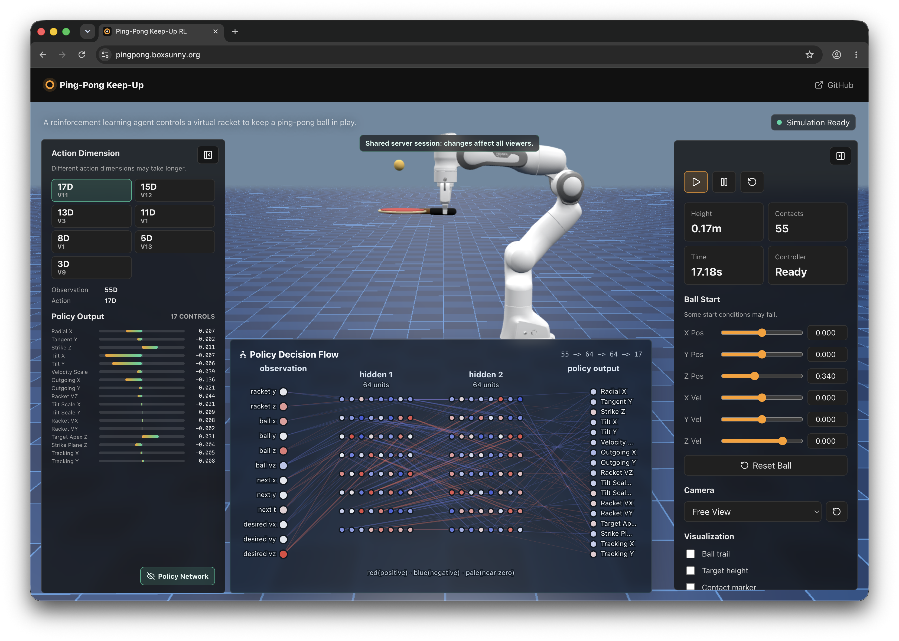

# Ping-Pong Keep-Up Web

Franka Panda 로봇팔이 탁구채로 탁구공을 반복해서 받아 올리는 keep-up 작업을 웹에서 시각화하는 프로젝트입니다.

서버는 MuJoCo 환경과 PPO로 학습된 policy를 실행하고, 브라우저는 WebSocket으로 받은 상태를 Three.js와 MuJoCo WebAssembly 장면에 반영합니다. 사용자는 웹 화면에서 로봇팔, 라켓, 공의 움직임과 접촉 결과를 실시간으로 확인할 수 있습니다.

## 주요 구성

- `FastAPI` backend: 학습된 policy 실행, MuJoCo step 계산, WebSocket stream 제공
- `React + Three.js` frontend: 로봇팔과 공의 움직임을 브라우저에서 렌더링
- `MuJoCo WebAssembly` viewer: 웹에서 시뮬레이션 장면을 시각적으로 재현
- `PPO keep-up policy`: 기준 타격 동작 위에 보정값을 더하는 residual action 구조

[https://pingpong.boxsunny.org/](https://pingpong.boxsunny.org/)

## 자세히 보기

- 실행, 빌드, 배포 방법: [상세 세팅 및 배포 문서](docs/project/setup.md)
- 학습 모델이 만들어진 과정: [모델 학습 과정 정리](docs/project/model-training-process-story.md)
